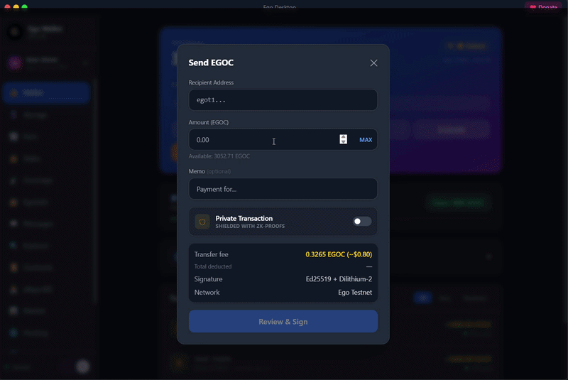

# Ego Blockchain

A post-quantum Layer-1 blockchain that pays node operators for contributing real infrastructure — storage, wireless coverage, retrieval and compute — rather than for burning electricity on proof-of-work.

<p align="center">
  
</p>

> **Status: public testnet.** The chain is live and producing blocks, but EGOC has no mainnet and is not tradeable. Mainnet launch follows an independent security audit. Testnet addresses use the `egot` prefix (`chain_id = 1`).

## What it does

Ego is a single client that runs a full node and pays for measured contribution:

| Contribution | What it proves | Rate |
|---|---|---|
| Storage | You hold encrypted fragments of other users' files | 0.5 EGOC / GB / day |
| Consensus | You validate and produce blocks | 10 EGOC / day |
| Coverage | You prove real wireless signal at your location | 8 EGOC / day |
| Retrieval | You serve stored fragments back on request | 2 EGOC / day |

Stored files are split, encrypted with AES-256-GCM and distributed, so an operator never holds a complete file or knows its contents.

## Cryptography

Every key is post-quantum from genesis — not a planned migration:

- **Signatures** — Ed25519 (classical) alongside CRYSTALS-Dilithium (post-quantum)
- **Key exchange** — CRYSTALS-Kyber
- **Hashing** — BLAKE2s
- **Addresses** — bech32, `egot` on testnet
- **Aggregation** — BLS signatures for validator quorums

## Repository layout

```
crates/
  ego-core             keys, hashing, address derivation
  ego-p2p              libp2p networking, peer discovery, gossip
  ego-consensus        BFT consensus engine
  ego-consensus-core   consensus primitives shared across implementations
  ego-vm  / ego-evm    Ego VM and EVM-compatible execution
  ego-rollup           L2 rollup logic
  ego-zk               zero-knowledge proof primitives
  ego-typed-signing    typed structured-data signing
  ego-ffi              C ABI for embedding
  urego-compiler       compiler for Urego, the contract language

bins/
  ego-node             headless full node
  ego-cli              command-line wallet and chain tools
  ego-relay            relay / rendezvous server
  urego                Urego contract compiler CLI

ego-desktop/           Tauri desktop app (Rust backend + React frontend)
extension/             Chrome MV3 browser wallet
mobile/                React Native client
sdk/                   TypeScript SDK and WalletConnect integration
services/              oracle, explorer, indexer, bridge relayer, presale proxy
contracts/             Urego contract library (DeFi, DEX, NFT, governance, …)
testnet/               Docker Compose testnet, genesis config, deploy scripts
```

## Building

Requires **Rust 1.85 or newer** (the workspace uses edition 2024) and **Node.js 20+** for the desktop app and SDK.

```bash
git clone https://github.com/ego-blockchain/ego-blockchain-
cd ego-blockchain-

# Workspace: node, CLI, relay, compiler and all crates
cargo build --release

# Run the headless node
cargo run --release --bin ego-node

# Command-line wallet
cargo run --release --bin ego-cli -- --help
```

### Desktop application

```bash
cd ego-desktop
npm install
npm run tauri dev          # development
npm run tauri build        # signed release bundle
```

On Windows, link errors of the form `LNK1318` are resolved by using `rust-lld.exe` rather than the MSVC linker.

### Local testnet

```bash
cd testnet
docker compose up
```

See [testnet/TESTNET.md](testnet/TESTNET.md) for multi-node setup. Each node on the same machine needs its own `EGO_DATA_DIR`, or they will contend for the same RocksDB lock.

## Tokenomics

Maximum supply is **1,000,000,000 EGOC** (1 EGOC = 1,000,000 uEGOC). Genesis allocations, defined in [`ego-desktop/src-tauri/src/tokenomics.rs`](ego-desktop/src-tauri/src/tokenomics.rs):

| Pool | Amount | Share |
|---|---:|---:|
| Node rewards | 300,000,000 | 30% |
| Block emissions | 210,000,000 | 21% |
| Ecosystem | 200,000,000 | 20% |
| Foundation | 150,000,000 | 15% |
| Staking rewards | 140,000,000 | 14% |

Block emissions release at 0.0832 EGOC per block with a halving every ~4 years, targeting a 120-year schedule. Transaction fees split 60% to block producers and 40% to the staking pool. Foundation funds vest linearly over 48 months, enforced at block-write time rather than by policy.

A 10,000,000 EGOC faucet is minted **on testnet only** and is excluded from mainnet genesis.

## Documentation

- Website - <https://egoblockchain.com>
- Protocol documentation — <https://egoblockchain.com/docs>
- Block explorer — <https://egoblockchain.com/egoscan>
- Desktop downloads — <https://egoblockchain.com/download>

## Contributing

Issues and pull requests are welcome. Consensus, cryptography and tokenomics changes are consensus-critical: please open an issue describing the problem before submitting a change to those areas.

## License

MIT — see [LICENSE](LICENSE).
